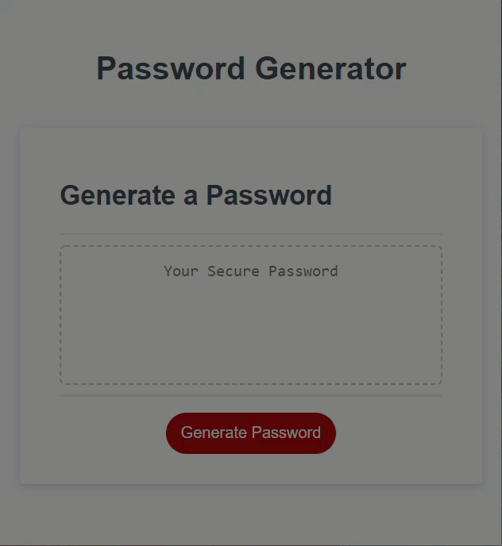
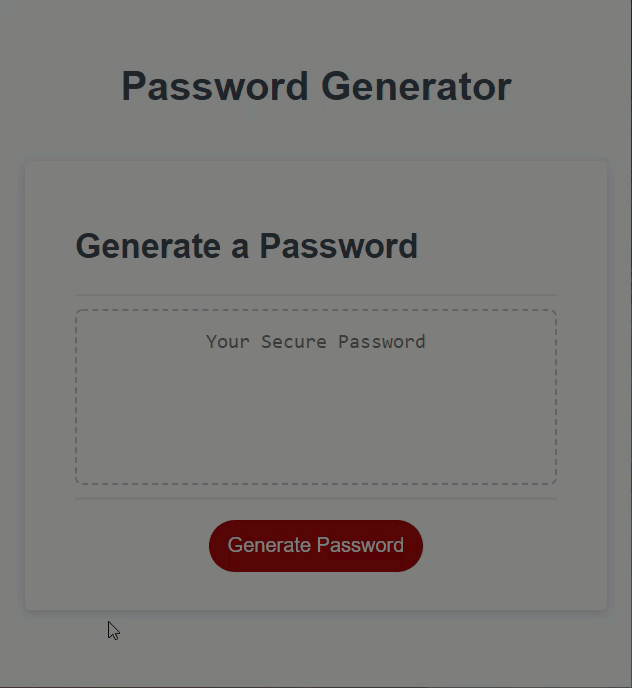

# Password Generator Project

## User Story
>AS AN employee with access to sensitive data  
I WANT to randomly generate a password that meets certain criteria  
SO THAT I can create a strong password that provides greater security

## Description

This projected tested the knowledge of JavaScript.  Although I was provided starter code, I had to create the functions to generate password along with the variables (arrays) of characters to use in the password.  I implemented our use of if...else statements and randomizing with .Math.  I ensured that the starter code was debugged and ran correctly.  This assignment was especially tough for me as I had previous knowledge of HTML and CSS for the prior project, but JavaScript is completely foreign to me. When I got stuck I used Google to research password generators and read through StackOverflow, and watched many YouTube videos, as well as researching specific elements in W3Schools and MDN. 

---

## Links

- Click the link below to access the deployed site on GitHub Pages. 
https://magmesser.github.io/password-generator/

- Click the link below to access to application repository on GitHub.  
https://github.com/magmesser/password-generator 

---

## Screenshot

The following images are screenshots of the web application's appearance: 

 
Generator working correctly

 
Generator alert if too little or too many characters are entered 

 
Generator alert if no criteria was selected

